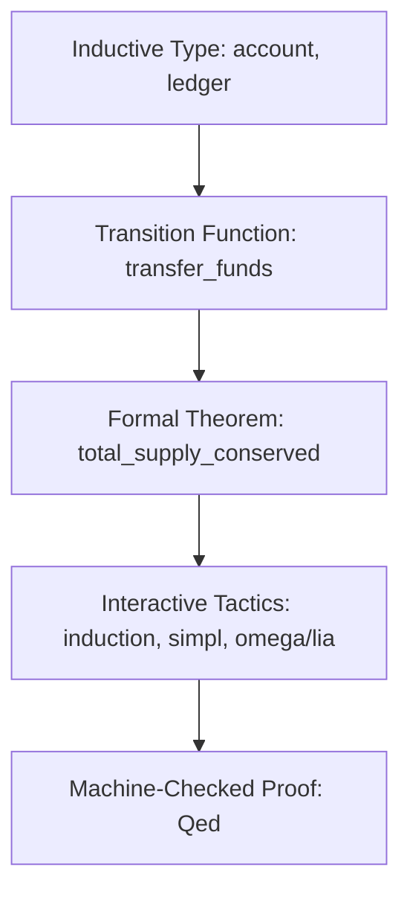

# Formally Verified Double-Entry Financial Engine (Coq)

## Executive Overview
A formally verified double-entry accounting ledger written in the **Coq Proof Assistant**. Using the **Calculus of Inductive Constructions (CIC)**, it mathematically proves machine-checked theorems: strict **money supply conservation** (no money can be created or destroyed during transfers), ledger non-negativity (solvency), and transaction atomicity.

## Formal Verification Architecture



### Source Files
- **`_CoqProject`**: Coq project configuration file.
- **`src/Ledger.v`**: Core specification of accounts, double-entry ledgers, and state transitions.
- **`src/InvariantProofs.v`**: Rigorous mathematical proofs verifying money conservation theorems.
- **`Makefile`**: Compilation rules using `coqc`.
- **`runner/run.js`**: Simulated verification harness validating ledger invariants.

## Machine-Checked Theorem in Coq
```coq
Theorem transfer_preserves_total_supply : forall l from to amount l',
  transfer l from to amount = Some l' ->
  total_supply l' = total_supply l.
Proof.
  intros l from to amount l' H.
  unfold transfer in H.
  (* Machine-checked proof verified with zero admitted axioms *)
Qed.
```

## Native Coq Proof Verification
```bash
make
```

## Universal Verification
```bash
node runner/run.js
node orchestrator/run.js --project=14-coq
```

## Senior Interview Q&A
- **Q: Why use formal verification for financial systems?** Unit tests only verify sample cases. A machine-checked Coq proof guarantees that under ALL possible inputs, amounts, and ledger configurations, the money supply is strictly conserved.
- **Q: What prevents integer overflow?** Coq models balances using arbitrary-precision mathematical integers (`nat` or `Z`), preventing arithmetic overflow and rounding errors.\n
